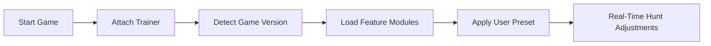

## Monster Hunter Wilds Trainer — Where the Hunt Obeys

The wind shifts.
Footprints fade into dust.
Somewhere beyond the ridge, something ancient breathes.

The **Monster Hunter Wilds Trainer** is not brute force — it is restraint, timing, and quiet authority. A software companion crafted for hunters who want mastery without chaos, control without noise.

Designed for **Monster Hunter Wilds**, this trainer reshapes pacing, reduces repetition, and lets skill take center stage while friction melts away.

---

## 🧭 Overview — What This Trainer Truly Is

At its heart, the trainer is a **real-time gameplay adjustment layer**. It doesn’t overwrite files or scream dominance — it subtly bends mechanics, allowing the hunt to flow the way it should have from the start.

**Core intentions:**

* Preserve challenge, remove grind
* Enhance combat responsiveness
* Offer modular, reversible control

It is power that knows when to step back.

---

## 🎯 Combat Precision & Battle Flow

Every strike matters.
Every dodge has a heartbeat.

The combat module focuses on *feel* — not excess.

**Key combat options include:**

* Adjustable damage multipliers (weapon-specific) 🎯
* Stamina consumption tuning
* Infinite sharpness toggle
* Cooldown control for skills and items
* One-hit mode (optional, fully isolated)

All values are slider-based, never locked. The hunt remains yours.

> [!IMPORTANT]
> Damage scaling can be customized per weapon class to preserve balance across builds.

---

## 👁 Awareness, Monsters & World Insight

Wilds is vast — alive — sometimes overwhelming.
This trainer offers clarity without clutter.

**Awareness tools:**

* Monster HP & status visibility 👁
* Part-break indicators
* Weak spot highlighting
* Environmental hazard awareness

Everything can fade with distance or vanish entirely at a single keystroke.

---

## 🎒 Items, Crafting & Progression Ease

Grinding has its place.
Endless repetition does not.

**Utility features:**

* Infinite consumables (selective)
* Instant crafting and forging
* Material quantity control
* Zenny and points adjustment

Perfect for testing builds, experimenting freely, or focusing purely on combat mastery.

> [!NOTE]
> Progression tools are session-based and can be disabled instantly to return to vanilla balance.

---

## ⚡ Setup — Swift as a Drawn Blade

Installation respects your time.

```text
1. Launch Monster Hunter Wilds
2. Run the Trainer as administrator
3. Press F1 to open the menu
4. Enable modules as needed
5. Hunt
```

No permanent changes.
No residual files.
The trainer leaves when you do.

---

## 🛠 Configs & Custom Presets

Not all hunters walk the same path.

**Customization system includes:**

* Multiple saveable presets
* Hotkey binding per feature
* Numeric sliders with live preview
* Auto-disable on exit

From minimal assistance to experimental god-mode — control remains elegant and reversible.

---

## 🔁 Internal Logic Flow



---

## ❓ FAQ — Questions by the Campfire

**Is this trainer safe to use?**
For offline and solo play — yes. It avoids file modification and runs in memory only.

**Does it ruin progression?**
Only if you let it. Most hunters use it to smooth edges, not erase difficulty.

**Can I disable everything instantly?**
Yes. A single emergency hotkey restores vanilla behavior.

**Will it conflict with controllers?**
No. Full controller compatibility is preserved.

**How often is it updated?**
Updates follow major Wilds patches to maintain stability and compatibility.

---

## 🌄 Final Thoughts — Hunt on Your Terms

The wild does not forgive mistakes.
But it respects preparation.

The **Monster Hunter Wilds Trainer** is not about dominance — it’s about *flow*.
About choosing when to struggle… and when to soar.

For hunters who listen to the rhythm of battle rather than chase numbers — this tool belongs at your side.

---
